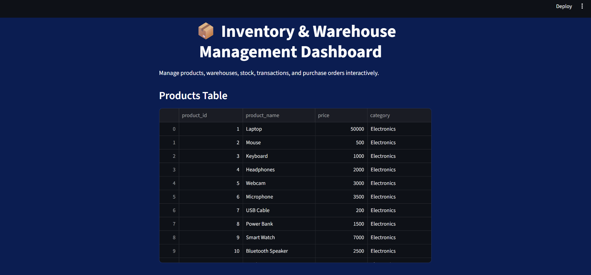
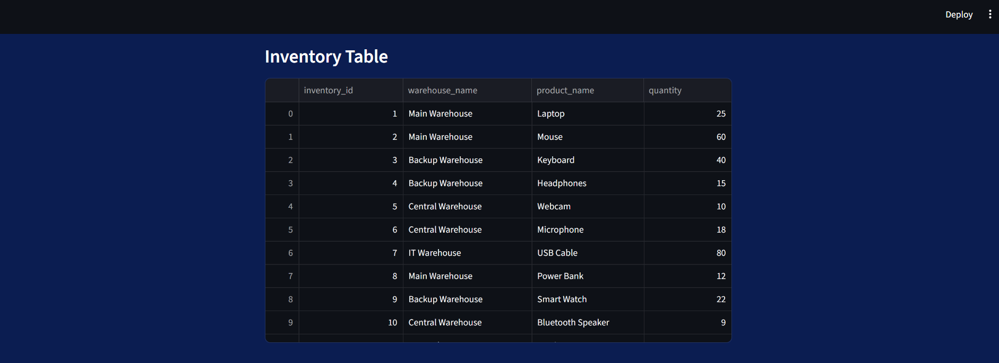
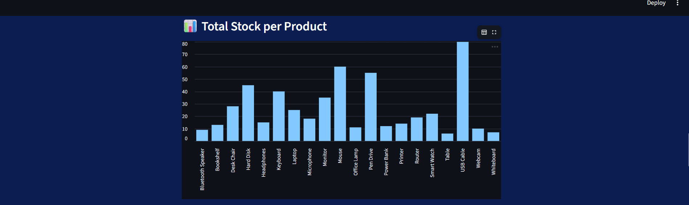
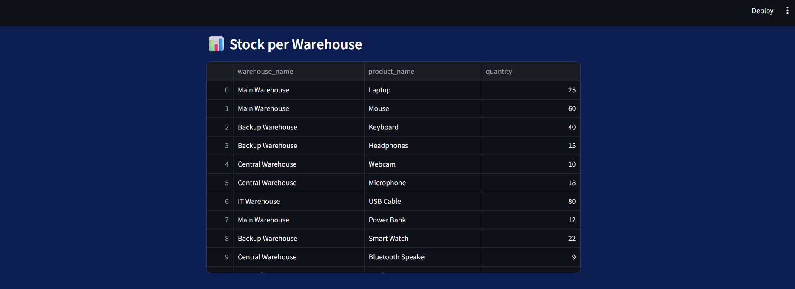
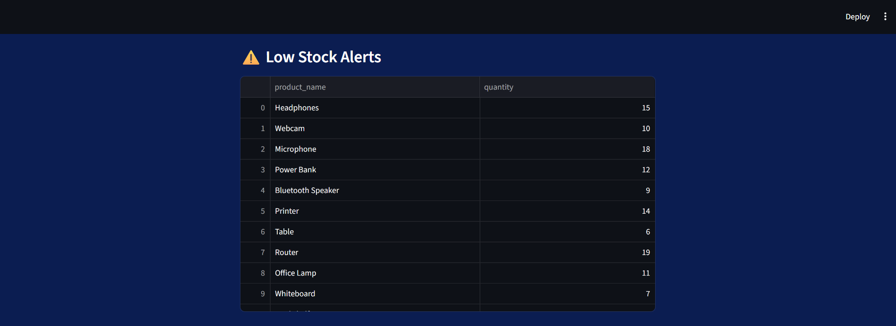
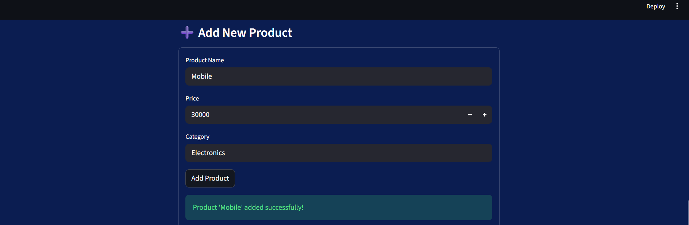
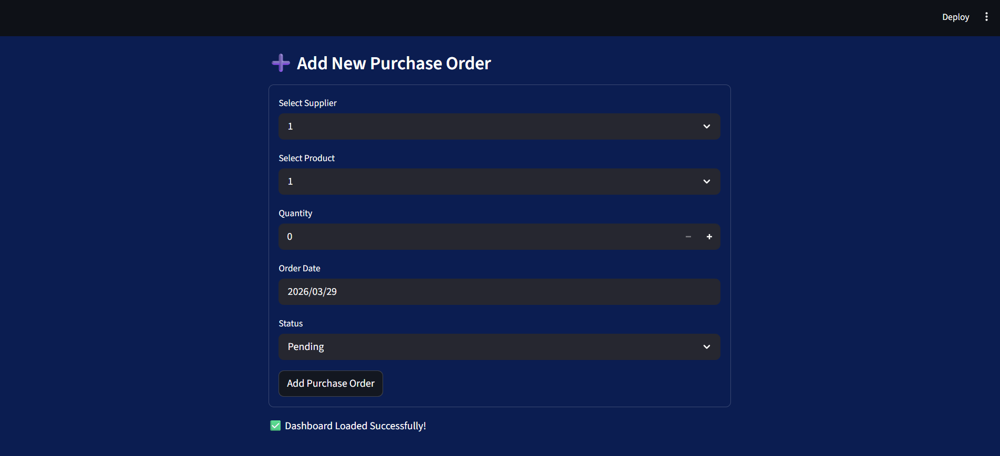
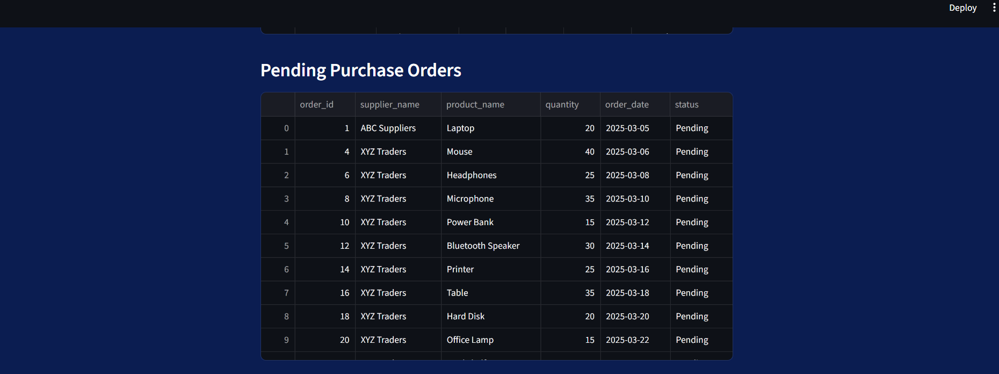

# 📦 Inventory & Warehouse Management System

## 📌 Project Description
This project is an industry-oriented Inventory and Warehouse Management System developed using MySQL and Streamlit. It helps manage products, warehouses, inventory, suppliers, and transactions efficiently.

The system solves real-world problems like stock mismatch, poor visibility, and inefficient inventory tracking by providing a centralized database and interactive dashboard.

## 🎯 Objectives
- Manage product and inventory data
- Track stock in and stock out transactions
- Handle supplier and purchase order details
- Provide real-time inventory visibility
- Generate insights using dashboard visualization

## 🛠️ Technologies Used
- Python
- Streamlit
- MySQL
- Pandas

## 🗄️ Database Tables
- Products
- Warehouse
- Inventory
- Suppliers
- Transactions
- PurchaseOrders

## 🚀 Features
- ➕ Add new products, warehouses, inventory
- 🔄 Track stock (IN / OUT transactions)
- 📊 Visual dashboard with charts
- ⚠️ Low stock alerts
- 📦 Warehouse-wise stock management
- 📑 Purchase order tracking

## 📊 Dashboard Highlights
- Total stock per product
- Stock distribution across warehouses
- Low stock alerts
- Transaction analysis (IN vs OUT)
- Pending purchase orders

## 📸 Project Screenshots

### Dashboard & Product Table

### Inventory Table

### Total Stock per Product

### Stock per Warehouse

### Low Stock Alerts

### Add New Product

### Add New Purchase Order

### Pending Purchase Orders

